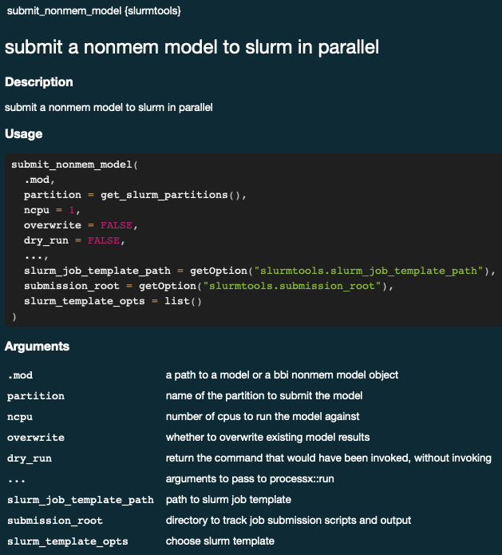
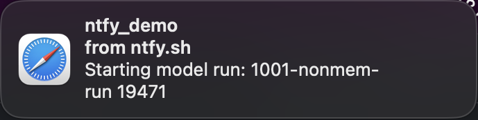

```{r, include = FALSE}
#removing generated files from running this vignette
nonmem <- file.path("model", "nonmem")

unlink(file.path(nonmem, "1001"), recursive = TRUE)
unlink(file.path(nonmem, "1001.yaml"))
unlink(file.path(nonmem, "1001.toml"))
unlink(file.path(nonmem, "submission-log"), recursive = TRUE) 
unlink(file.path(nonmem, "in_progress"), recursive = TRUE)
```

```{r, include = FALSE}
knitr::opts_chunk$set(
  collapse = TRUE,
  comment = "" 
)
```

# Slurmtools for submitting NONMEM runs

`slurmtools` is an R package for interacting with slurm (fka **S**imple **L**inux **U**tility for **R**esource **M**anagement) and submitting NONMEM jobs. You can submit a NONMEM job with `submit_nonmem_model`, you can view current jobs with `get_slurm_jobs`, and you can see the available partitions with `get_slurm_partitions`.

## Installing `slurmtools`

To install `slurmtools` use the following commands:

``` r
options(repos = c(
  "slurmtools" = "https://a2-ai.github.io/gh-pkg-mirror/slurmtools", 
  getOption("repos")))
install.packages("slurmtools")
```

```{r setup}
library(slurmtools)
```

We are given a message when loading slurmtools that some options are not set and that default job submission will not work without them. These options are used for default arguments in the `submit_nonmem_model` function. Running `?submit_nonmem_model` we can see the documentation

This function uses the inputs to populate a template Bash shell script that submits the NONMEM job to slurm. A default template file is supplied with the Project Starter and it can be modified to do additional tasks as long as they are possible within Bash.

By default these values are provided to the slurm template file:

``` r
list(
  partition = partition,
  parallel = parallel,
  ncpu = ncpu,
  job_name = sprintf("%s-nonmem-run", basename(.mod$absolute_model_path)),
  model_path = .mod$absolute_model_path,
  config_toml_path = config_toml_path,
  nmm_exe_path = Sys.which("nmm")
)
```

-   `partition` is an argument to `submit_nonmem_model`

-   `parallel` is `TRUE` if `ncpu > 1`, else `FALSE`

-   `ncpu` is an argument to `submit_nonmem_model`

-   `job_name` is created from the `.mod` argument supplied to `submit_nonmem_model`

-   `model_path` is determined from the `.mod` argument supplied to `submit_nonmem_model`

-   `config_toml_path` is determined from the `.mod` argument supplied to `submit_nonmem_model` and is requried to use `nmm` (NONMEM monitor)

-   `nmm_exe_path` is determined via `Sys.which("nmm")`

If you need to feed more arguments to the template you simply supply them in the `slurm_template_opts` argument as a list. More on that later.

## Submitting a NONMEM job with `bbi`

To submit a NONMEM job, we need to supply either the path to a mod file or create a model object from `bbr`, and supply a `slurm-template.tmpl` file. To use `bbi` we also need a `bbi.yaml` file, which I've also supplied in `/model/nonmem/bbi.yaml`.

Here is an example of a template file that will call `bbi`:

``` slurm-job-bbi.tmpl
#!/bin/bash
#SBATCH --job-name="{{job_name}}"
#SBATCH --nodes=1
#SBATCH --ntasks=1
#SBATCH --cpus-per-task={{ncpu}}
#SBATCH --partition={{partition}}

# submit_nonmem_model uses the whisker package to populate template files
# https://github.com/edwindj/whisker

{{#parallel}}
{{bbi_exe_path}} nonmem run local {{model_path}}.mod --parallel --threads={{ncpu}} --config {{bbi_config_path}}
{{/parallel}}


{{^parallel}}
{{bbi_exe_path}} nonmem run local {{model_path}}.mod --config {{bbi_config_path}}
{{/parallel}}
```

This file will call `bbi` to run our supplied model (`{{model_path}}.mod`) if `ncpu > 1` then parallel will be true and the code between `{{#parallel}}` and `{{/parallel}}` will be populated. if `ncpu = 1` then parallel will be false and the code between `{{^parallel}}` and `{{/parallel}}` will be populated. Notice we'll have to supply the `bbi_exe_path` for it to start the NONMEM run because `submit_nonmem_model` does not supply that variable to the template by default.

We will use a few different template files with different functionality so we'll inject those template file paths to `submit_nonmem_model`. However, we'll use the `submission-log` directory for the output, so we'll set that option so `submit_nonmem_model` default can be used. The slurm template files are saved in `~/model/nonmem/` Additionally, there is a simple NONMEM control stream in `1001.mod` in the same directory that we can use for testing.

```{r}
library(bbr)
library(here)

nonmem = file.path(here::here(), "vignettes", "model", "nonmem")

options('slurmtools.submission_root' = file.path(nonmem, "submission-log"))
```

To create the bbr model object, we need to have both `1001.mod` and `1001.yaml` which contains metadata about the model in the supplied directory (`/model/nonmem/`).

```{r}
mod_number <- "1001"

if (file.exists(file.path(nonmem, paste0(mod_number, ".yaml")))) {
  mod <- bbr::read_model(file.path(nonmem, mod_number))
} else {
  mod <- bbr::new_model(file.path(nonmem, mod_number))
}
```

We can now submit the job and point to the template file in `model/nonmem/slurm-job-bbi.tmpl`

```{r}
submission <- slurmtools::submit_nonmem_model(
  mod,
  slurm_job_template_path = file.path(nonmem, "slurm-job-bbi.tmpl"),
  slurm_template_opts = list(
    bbi_exe_path = Sys.which("bbi"),
    bbi_config_path = file.path(nonmem, "bbi.yaml"))
)

submission
```

Notice we get a Warning about a config.toml file not being found. I'll expand on that later, but for now we see a `status` with an exit code of 0 suggesting a successful command, and the `stdout` gives us the batch job number. We can use `slurmtools::get_slurm_jobs()` to monitor the status of the job. Here, I've filtered the results to only show the job I just submitted above.

```{r}
slurmtools::get_slurm_jobs(user = 'matthews')
```

If we look in the `slurmtools.submisstion_root` directory we can see the shell script that was generated with `submit_nonmem_model`. Here is the whisker replaced call to bbi:

``` 1001.sh
/usr/local/bin/bbi nonmem run local /cluster-data/user-homes/matthews/Projects/slurmtools_vignette/model/nonmem/1001.mod --config /cluster-data/user-homes/matthews/Projects/slurmtools_vignette/model/nonmem/bbi.yaml
```

## Extending templates

Because the templates create a bash shell script there is an almost infinite number of things we can do with our template. **Anything you can do in bash you can do by appropriately updating the template file and injecting the needed information!**

Let's add a notification feature that will send a notification when the job has started and finished. We can use [ntfy.sh](ntfy.sh) and add the necessary info to our template to achieve this.

Here is a modified template file that adds a `JOBID=$SLURM_JOBID` and some ntfy calls. To get a notification we can supply `submit_nonmem_model` with `ntfy` variable to send notifications. I'll use `ntfy = ntfy_demo` for this.

``` slurm-job-bbi-ntfy.tmpl
#!/bin/bash
#SBATCH --job-name="{{job_name}}"
#SBATCH --nodes=1
#SBATCH --ntasks=1
#SBATCH --cpus-per-task={{ncpu}}
#SBATCH --partition={{partition}}

JOBID=$SLURM_JOBID

# submit_nonmem_model uses the whisker package to populate template files
# https://github.com/edwindj/whisker

{{#ntfy}}
curl -d "Starting model run: {{job_name}} $JOBID" ntfy.sh/{{ntfy}}
{{/ntfy}}

{{#parallel}}
{{bbi_exe_path}} nonmem run local {{model_path}}.mod --parallel --threads={{ncpu}} --config {{bbi_config_path}}
{{/parallel}}

{{^parallel}}
{{bbi_exe_path}} nonmem run local {{model_path}}.mod --config {{bbi_config_path}}
{{/parallel}}

{{#ntfy}}
curl -d "Finished model run: {{job_name}} $JOBID" ntfy.sh/{{ntfy}}
{{/ntfy}}
```

Since we've already run this model we will provide the `overwrite = TRUE` argument to force a new nonmem run.

```{r}
submission_ntfy <- slurmtools::submit_nonmem_model(
  mod, 
  slurm_job_template_path = file.path(nonmem, "slurm-job-bbi-ntfy.tmpl"),
  overwrite = TRUE,
  slurm_template_opts = list(
    bbi_exe_path = Sys.which("bbi"),
    bbi_config_path = file.path(nonmem, "bbi.yaml"),
    ntfy = "ntfy_demo")
)

submission_ntfy
```

We again get a 0 exit code status and now instead of using `slurmtools::get_slurm_jobs()` to monitor the job, we can rely on the new notifications we just set up. 

and when the run finished we get another notification: 

Note that the run number will match the run specified in `submission$stdout`. We can see the new shell script this updated template file generated

``` 1001.sh
#!/bin/bash
#SBATCH --job-name="1001-nonmem-run"
#SBATCH --nodes=1
#SBATCH --ntasks=1
#SBATCH --cpus-per-task=1
#SBATCH --partition=cpu2mem4gb

JOBID=$SLURM_JOBID

curl -d "Starting model run: 1001-nonmem-run $JOBID" ntfy.sh/ntfy_demo

/usr/local/bin/bbi nonmem run local /cluster-data/user-homes/matthews/Projects/slurmtools_vignette/model/nonmem/1001.mod --config /cluster-data/user-homes/matthews/Projects/slurmtools_vignette/model/nonmem/bbi.yaml

curl -d "Finished model run: 1001-nonmem-run $JOBID" ntfy.sh/ntfy_demo
```

To reiterate, this template file is run as a bash shell script so anything you can do in bash you can put into the template and pass the needed arguments and customize the behavior to your liking.

```{r, include = FALSE}
#cancelling any running nonmem jobs
state <- slurmtools::get_slurm_jobs(user = "matthews")

if (any(state$job_state %in% c("RUNNING", "CONFIGURING"))) {
  for (job_id in state %>% dplyr::filter(job_state == "RUNNING") %>% dplyr::pull("job_id")) {
    processx::run("scancel", args = paste0(job_id))
  }
}

#removing generated files from running this vignette
nonmem <- file.path("model", "nonmem")

unlink(file.path(nonmem, "1001"), recursive = TRUE)
unlink(file.path(nonmem, "1001.yaml"))
unlink(file.path(nonmem, "1001.toml"))
unlink(file.path(nonmem, "submission-log"), recursive = TRUE) 
unlink(file.path(nonmem, "in_progress"), recursive = TRUE)
```
