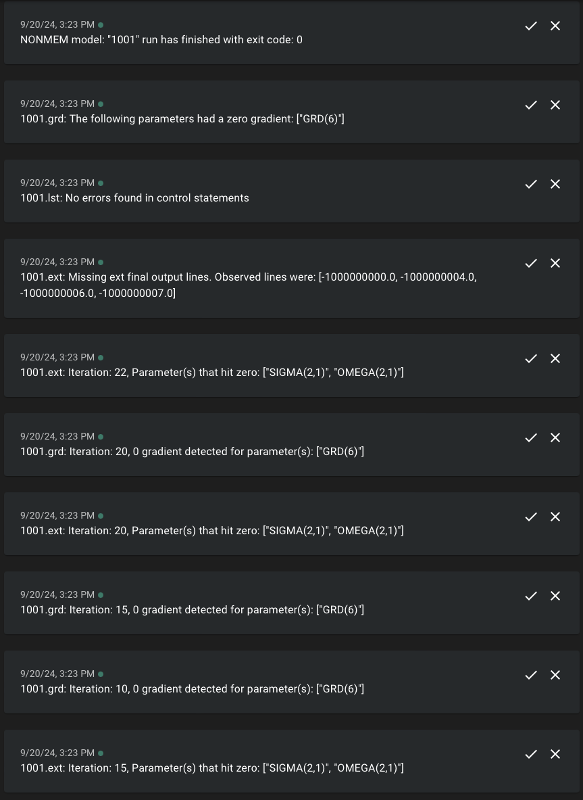

```{r, include = FALSE}
#removing generated files from running this vignette
nonmem <- file.path("model", "nonmem")

unlink(file.path(nonmem, "1001"), recursive = TRUE)
unlink(file.path(nonmem, "1001.yaml"))
unlink(file.path(nonmem, "1001.toml"))
unlink(file.path(nonmem, "submission-log"), recursive = TRUE) 
unlink(file.path(nonmem, "in_progress"), recursive = TRUE)
```

```{r, include = FALSE}
knitr::opts_chunk$set(
  collapse = TRUE,
  comment = "#>"
)
```

```{r setup}
library(slurmtools)
library(bbr)
library(here)

nonmem = file.path(here::here(), "vignettes", "model", "nonmem")
options('slurmtools.submission_root' = file.path(nonmem, "submission-log"))
```

## Submitting a NONMEM job with nmm

Instead of using bbi we can use `nmm` ([NONMEM
Monitor](https://github.com/A2-ai/nonmem-monitor)) which currently has
some additional functionality of sending notifications about zero
gradients, missing -1E9 lines in ext file, and some very basic control
stream errors. Currently, only slack or [ntfy.sh](ntfy.sh) is supported
for receiving notifications. To use `nmm` you can install the latest
release from the github repository linked above.

We can update the template file accordingly:

``` slurm-job-nmm.tmpl
#!/bin/bash 
#SBATCH --job-name="{{job_name}}" 
#SBATCH --nodes=1 
#SBATCH --ntasks=1
#SBATCH --cpus-per-task={{ncpu}} 
#SBATCH --partition={{partition}}

{{nmm_exe_path}} -c {{config_toml_path}} run
```

default, `submit_nonmem_model` will provide `nmm_exe_path` and
`config_toml_path` to the template. Just like with `bbi_exe_path`,
`nmm_exe_path` is determined with `Sys.which("nmm")` which may or may
not give you the path to the nmm binary if it is on your path or not. We
can inject the `nmm_exe_path` like we did with `bbi_exe_path` and assume
it's not on our path.

Remember that error about the `config.toml` file not existing? Well this
is the reason. This file controls what `nmm` will monitor and where to
look for files and how to alert you. We'll use `generate_nmm_config()`
to create this file. First we can look at the documentation to see what
type of information we should pass to this function.

```{r}
mod_number <- "1001"

if (file.exists(file.path(nonmem, paste0(mod_number, ".yaml")))) {
  mod <- bbr::read_model(file.path(nonmem, mod_number))
} else {
  mod <- bbr::new_model(file.path(nonmem, mod_number))
}
```

```{r}
slurmtools::generate_nmm_config(mod)
```

This generates the following toml file. Notice that alert is set to
'None', and both email and topic are empty. Since we're in vignettes
we'll need to update the `watched_dir` and `output_dir`.

``` 1001.toml
model_number = '1001'
files_to_track = [ 'lst', 'ext', 'grd' ]
tmp_dir = '/tmp'
watched_dir = '/cluster-data/user-homes/matthews/Packages/slurmtools/model/nonmem'
output_dir = '/cluster-data/user-homes/matthews/Packages/slurmtools/model/nonmem/in_progress'
poll_duration = 1
alert = 'None'
level = 'Debug'
email = ''
threads = 1
topic = ''
```

```{r}
slurmtools::generate_nmm_config( 
  mod, 
  watched_dir = "/cluster-data/user-homes/matthews/Packages/slurmtools/vignettes/model/nonmem",
  output_dir = "/cluster-data/user-homes/matthews/Packages/slurmtools/vignettes/model/nonmem/in_progress")
```

This updates the `1001.toml` config file to:

``` 1001.toml
model_number = '1001'
files_to_track = [ 'lst', 'ext', 'grd' ]
tmp_dir = '/tmp'
watched_dir = '/cluster-data/user-homes/matthews/Packages/slurmtools/vignettes/model/nonmem'
output_dir = '/cluster-data/user-homes/matthews/Packages/slurmtools/vignettes/model/nonmem/in_progress'
poll_duration = 1
alert = 'None'
level = 'Debug'
email = ''
threads = 1
topic = ''
```

We can now run `submit_nonmem_model` and get essentially the same
behavior as running with `bbi`.

```{r}
submission_nmm <- slurmtools::submit_nonmem_model( 
  mod, 
  overwrite = TRUE,
  slurm_job_template_path = file.path(nonmem, "slurm-job-nmm.tmpl"),
  slurm_template_opts = list(
    nmm_exe_path = normalizePath("~/.local/bin/nmm-x86_64-unknown-linux-gnu/nmm"))
)

submission_nmm
```

```{r}
slurmtools::get_slurm_jobs()
```

The one difference between using `nmm` compared to `bbi` is that a new
directory is created that contains a log file that caught some issues
with our run. This file is updated as nonmem is running and monitors
gradient values, parameters that hit zero, as well as other errors from
bbi. Looking at the first few lines we can see that `bbi` was
successfully able to call nonmem. We also see an info level log that
OMEGA(2,1) has 0 value – in our mod file we don't specify any omega
values off the diagonal so these are fixed at 0. Finally we see that
GRD(6) hit 0 relatively early in the run.

``` vignettes/model/nonmem/in_progress/1001/modeling_run_20240827201226.log
20:12:36 [INFO] bbi log: time="2024-08-27T20:12:36Z" level=info msg="Successfully loaded default configuration from /cluster-data/user-homes/matthews/Packages/slurmtools/vignettes/model/nonmem/bbi.yaml"
20:12:36 [INFO] bbi log: time="2024-08-27T20:12:36Z" level=info msg="Beginning Local Path"
20:12:36 [INFO] bbi log: time="2024-08-27T20:12:36Z" level=info msg="A total of 1 models have completed the initial preparation phase"
20:12:36 [INFO] bbi log: time="2024-08-27T20:12:36Z" level=info msg="[1001] Beginning local work phase"
20:12:58 [INFO] OMEGA(2,1) has 0 value
20:12:58 [INFO] SIGMA(2,1) has 0 value
20:13:00 [INFO] SIGMA(2,1) has 0 value
20:13:00 [INFO] OMEGA(2,1) has 0 value
20:13:04 [INFO] SIGMA(2,1) has 0 value
20:13:04 [INFO] OMEGA(2,1) has 0 value
20:13:04 [WARN] "/cluster-data/user-homes/matthews/Packages/slurmtools/vignettes/model/nonmem/1001/1001.grd" has 0 gradient for parameter: GRD(6) 
```

After a run has finished several messages are sent to the log after a
final check of the files listed in the `files_to_track` field of the
`1001.toml` file.

``` vignettes/model/nonmem/in_progress/1001/modeling_run_20240827201226.log
20:13:16 [INFO] Received Exit code: exit status: 0
20:13:16 [WARN] 1001.ext: Missing ext final output lines. Observed lines were: [-1000000000.0, -1000000004.0, -1000000006.0, -1000000007.0]
20:13:16 [WARN] "/cluster-data/user-homes/matthews/Packages/slurmtools/vignettes/model/nonmem/1001/1001.grd": The following parameters hit zero gradient through the run: ["GRD(6)"]
```

We see that GRD(6) hit zero during the run and that only a subset of the
-1E9 lines were present in the .ext file.

## Getting alerted during a run

Like we did with `bbi` and altering the slurm template file to get
notifications from [ntfy.sh](ntfy.sh) `nmm` has this feature built in!
The messages in the log file that relate to zero gradients, missing -1E9
lines, and 0 parameter values can also be sent to ntfy by altering the
`1001.toml` file. We can get these alerts in real time without having to
dig through a noisy log file.

Let's update our call to `generate_nmm_config` to have `nmm` send
notifications to the `NONMEMmonitor` topic on [ntfy.sh](ntfy.sh).

```{r}
slurmtools::generate_nmm_config( 
  mod, 
  alert = "Ntfy",
  topic = "NONMEMmonitor",
  watched_dir = "/cluster-data/user-homes/matthews/Packages/slurmtools/vignettes/model/nonmem",
  output_dir = "/cluster-data/user-homes/matthews/Packages/slurmtools/vignettes/model/nonmem/in_progress")
```

This updates the `1001.toml` file to this:

``` 1001.toml
model_number = '1001'
files_to_track = [ 'lst', 'ext', 'grd' ]
tmp_dir = '/tmp'
watched_dir = '/cluster-data/user-homes/matthews/Packages/slurmtools/vignettes/model/nonmem'
output_dir = '/cluster-data/user-homes/matthews/Packages/slurmtools/vignettes/model/nonmem/in_progress'
poll_duration = 1
alert = 'Ntfy'
level = 'Debug'
email = ''
threads = 1
topic = 'NONMEMmonitor'
```

When we re-run the `submit_nonmem_model` call we will now get ntfy
notifications. One thing to note is that `nmm` will print full paths in
the log, but will only send notifications with the `model_number` (or
`model_number.file_extension`).

```{r}
submission_nmm <- slurmtools::submit_nonmem_model( 
  mod, 
  overwrite = TRUE,
  slurm_job_template_path = file.path(nonmem, "slurm-job-nmm.tmpl"),
  slurm_template_opts = list(
    nmm_exe_path = normalizePath("~/.local/bin/nmm-x86_64-unknown-linux-gnu/nmm"))
)

submission_nmm
```

```{r}
slurmtools::get_slurm_jobs(user = "matthews")
```

This gives us the notifications in a much more digestible format



```{r, include = FALSE}
#cancelling any running nonmem jobs
state <- slurmtools::get_slurm_jobs(user = "matthews")

if (any(state$job_state %in% c("RUNNING", "CONFIGURING"))) {
  for (job_id in state %>% dplyr::filter(job_state == "RUNNING") %>% dplyr::pull("job_id")) {
    processx::run("scancel", args = paste0(job_id))
  }
}

#removing generated files from running this vignette
nonmem <- file.path("model", "nonmem")

unlink(file.path(nonmem, "1001"), recursive = TRUE)
unlink(file.path(nonmem, "1001.yaml"))
unlink(file.path(nonmem, "1001.toml"))
unlink(file.path(nonmem, "submission-log"), recursive = TRUE) 
unlink(file.path(nonmem, "in_progress"), recursive = TRUE)
```
