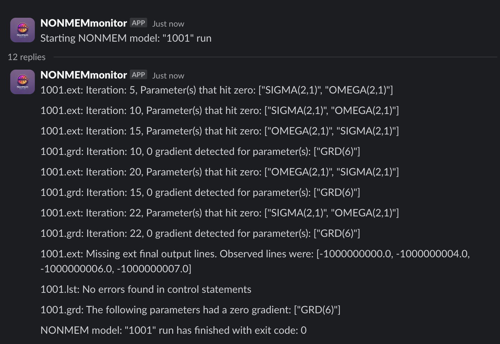

```{r, include = FALSE}
#removing generated files from running this vignette
nonmem <- file.path("model", "nonmem")

unlink(file.path(nonmem, "1001"), recursive = TRUE)
unlink(file.path(nonmem, "1001.yaml"))
unlink(file.path(nonmem, "1001.toml"))
unlink(file.path(nonmem, "submission-log"), recursive = TRUE) 
unlink(file.path(nonmem, "in_progress"), recursive = TRUE)
```

```{r, include = FALSE}
knitr::opts_chunk$set(
  collapse = TRUE,
  comment = ""
)
```

```{r setup}
library(slurmtools)
library(bbr)
library(here)

nonmem = file.path(here::here(), "vignettes", "model", "nonmem")
options('slurmtools.submission_root' = file.path(nonmem, "submission-log"))
```

```{r}
mod_number <- "1001"

if (file.exists(file.path(nonmem, paste0(mod_number, ".yaml")))) {
  mod <- bbr::read_model(file.path(nonmem, mod_number))
} else {
  mod <- bbr::new_model(file.path(nonmem, mod_number))
}
```

# Cut me some Slack

There is also functionality to pair `nmm` with
[slack_notifier](https://github.com/A2-ai/slack_notifier/releases/) and
get messages sent directly to you via a slack bot. This requires you to
download the slack_notifier binaries. You can download the latest
release and extract the binary and again save it to `~/.local/bin`.

```{r}
Sys.which("snt")
```

`snt` requires the slack bot OAuth token which is found from
[[[https://api.slack.com/apps/\\\\](https://api.slack.com/apps/){.uri}](%5Bhttps://api.slack.com/apps/%5D(https://api.slack.com/apps/)%7B.uri%7D){.uri}\<YOUR
APP ID\> /oauth?]. This can be saved in a file and fed into the `snt`
with the `tokenFile` flag.

``` slack_notifier/config.yaml
token: "encrypted(Bot User OAuth Token)"
```

Again, we need to update the `1001.toml` file to get slack
notifications. If we look at the `snt` help message we see that it
should be called via
`snt slack -c config_file -k decryption_key -a token -f tokenFile -e email -m message -t timestamp`

the config_file can contain the key, and token file so you don't need to
repeatedly use that information. I've saved the tokenFile location and
key in a config file in `~/.local/bin/slack_notifier_settings.yaml` and
will use the -c flag to point to that.

With this our call to `snt` would look like:

`snt slack -c ~/.local/bin/slack_notifier_settings.yaml -e matthews@a2-ai.com -m "Hello"`

The timestamp flag is needed if we want to reply to a message, which to
save on spamming alerts we want to do. However, since we can't possible
know the timestamp of a message we have yet to send we don't have a way
of specifying this argument now. This is what the use_stdout argument
for `nmm` alerter is for. It will capture the standard out of the call
to the alerter binary and parse it for additional flags to use on
subsequent calls. With all this in mind, we can update our `nmm` config
to achieve this slack messaging.

```{r}
slurmtools::generate_nmm_config( 
  mod, 
  watched_dir = "/cluster-data/user-homes/matthews/Packages/slurmtools/vignettes/model/nonmem",
  output_dir = "/cluster-data/user-homes/matthews/Packages/slurmtools/vignettes/model/nonmem/in_progress",
  alerter_opts = list(
    alerter = Sys.which('snt'), #binary location of nmm,
    command = "slack",
    message_flag = "m", #This is the default so we don't need to specify it
    use_stdout = TRUE, #captures output of snt -- which will include --timestamp aksfl;ajklajl;
    args = list(email = "matthews@a2-ai.com", config = "/cluster-data/user-homes/matthews/.local/bin/slack_notifier_settings.yaml")
  )
  )
```

This generates the following toml file:

``` 1001.toml
model_number = '1001'
watched_dir = '/cluster-data/user-homes/matthews/Packages/slurmtools/vignettes/model/nonmem'
output_dir = '/cluster-data/user-homes/matthews/Packages/slurmtools/vignettes/model/nonmem/in_progress'

[alerter]
alerter = '/cluster-data/user-homes/matthews/.local/bin/snt'
command = 'slack'
message_flag = 'm'
use_stdout = true

[alerter.args]
email = 'matthews@a2-ai.com'
config = '/cluster-data/user-homes/matthews/.local/bin/slack_notifier_settings.yaml'
```

With `alert = 'Slack'` and `email` set in the `1001.toml` file `nmm`
will send slack notifications directly to you when a NONMEM run starts
and it will reply to that message with notifications if any gradients
hit 0 and when the run finishes it checks if all -1E9 lines are present
in the .ext file and gives another message about any parameters that hit
0 gradient.

```{r}
submission_nmm <- slurmtools::submit_nonmem_model( 
  mod, 
  overwrite = TRUE,
  slurm_job_template_path = file.path(nonmem, "slurm-job-nmm.tmpl"),
  slurm_template_opts = list(
    nmm_exe_path = normalizePath("~/.local/bin/nmm")
  )
)

submission_nmm
```

```{r}
slurmtools::get_slurm_jobs(user = "matthews")
```



```{r, include = FALSE}
# #cancelling any running nonmem jobs
# state <- slurmtools::get_slurm_jobs(user = "matthews")
# 
# if (any(state$job_state %in% c("RUNNING", "CONFIGURING"))) {
#   for (job_id in state %>% dplyr::filter(job_state == "RUNNING") %>% dplyr::pull("job_id")) {
#     processx::run("scancel", args = paste0(job_id))
#   }
# }
# 
# #removing generated files from running this vignette
# nonmem <- file.path("model", "nonmem")
# 
unlink(file.path(nonmem, "1001"), recursive = TRUE)
unlink(file.path(nonmem, "1001.yaml"))
unlink(file.path(nonmem, "1001.toml"))
unlink(file.path(nonmem, "submission-log"), recursive = TRUE)
unlink(file.path(nonmem, "in_progress"), recursive = TRUE)
```
